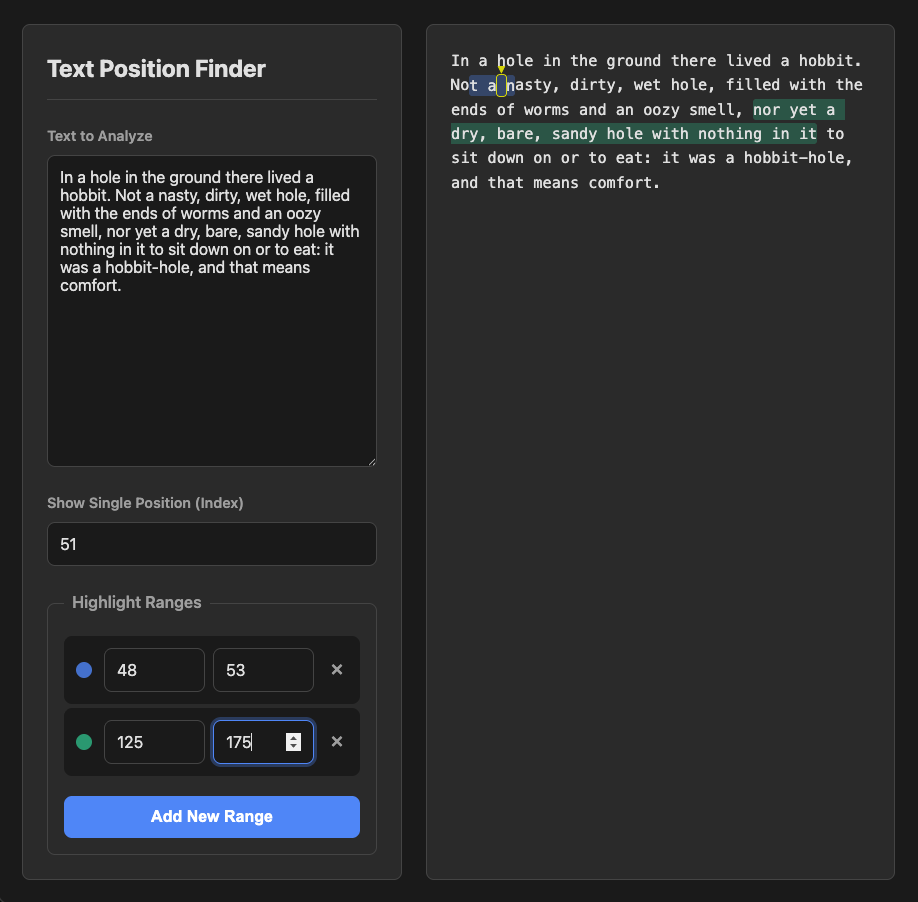

# Text Position Finder

A simple, client-side web app to highlight specific character positions and ranges within a block of text.

## Screenshot




## Features

-   Paste any block of text into the main text area.
-   Specify a single character position (by index) to mark it with an arrow.
-   Define multiple start/end ranges to highlight segments of text.
-   Each range is automatically color-coded for easy differentiation.
-   Handles overlapping ranges by displaying a striped gradient of all applicable colors.
-   Pure client-side vanilla HTML, CSS, and JavaScript. **No data is ever sent to a server.**

## ⚠️ Quality

This was quickly hacked together with AI to solve an immediate, specific problem. It was built as a pragmatic tool for a necessary task, not as a portfolio piece.

**It makes no claims of being robust, feature-complete, or high-quality code. It works, and that's about it.** Feel free to use it if it helps you, but please be aware of its origin.

## Getting Started

Because this project uses ES Modules for its JavaScript, you cannot run it by simply opening the `index.html` file in your browser. You need to serve it from a simple local web server.

**Start a local server:**  
You have several easy options:

-   **Using Python:**
    ```bash
    python -m http.server
    ```
-   **Using Node.js/npm:**
    ```bash
    npx serve
    ```
-   **Using the VS Code "Live Server" extension:**  
    Right-click on `index.html` and select "Open with Live Server".

## Tech Stack

Just the basics:
-   HTML5
-   CSS3
-   Vanilla JavaScript (ES Modules)

## License

This project is under the [MIT License](LICENSE). Feel free to use, modify, or distribute it.